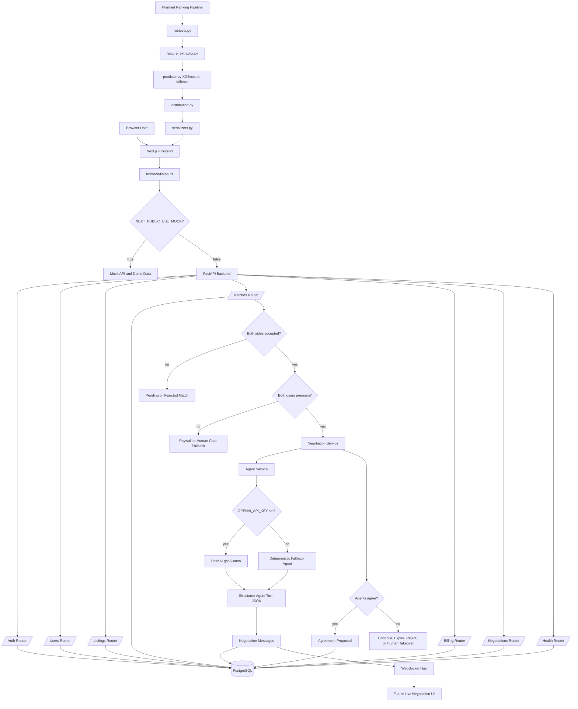

# InfluMatch Architecture

This document describes the current repository architecture and the additions that are being introduced for the next MVP iteration.

## Current Runtime Topology

```text
Browser
  |
  | Next.js app, React UI, mock/demo mode
  v
frontend/
  |
  | HTTP JSON API
  | NEXT_PUBLIC_API_URL=http://localhost:8000
  v
backend/
  |
  | SQLAlchemy ORM
  | DATABASE_URL=postgresql://app:app@db:5432/app
  v
PostgreSQL
```

Docker Compose starts three services:

- `frontend`: Next.js app on port `3000`
- `backend`: FastAPI app on port `8000`
- `db`: PostgreSQL on port `5432`

The backend currently creates SQLAlchemy tables on startup for MVP speed. Alembic migrations are still a production-readiness task.

## Architecture Flowchart



## Frontend Architecture

The frontend lives under `frontend/` and uses:

- Next.js App Router
- React 19 and TypeScript
- Tailwind CSS
- shadcn/Radix UI primitives in `frontend/components/ui/`
- React Query dependency is installed, but the current API helper mostly uses direct `fetch`

Important areas:

```text
frontend/app/                 Route pages and layouts
frontend/components/          Shared UI components
frontend/components/site/     Marketing/navigation shell
frontend/components/matchfluence/
                              Swipe demo and campaign scoring UI
frontend/lib/api.ts           Backend API client and mock switch
frontend/lib/mockApi.ts       Demo-mode API behavior
frontend/lib/mock-data.ts     Demo data
frontend/types/index.ts       Frontend-facing TypeScript contracts
frontend/data/                Matchfluence influencer seed data
```

The current Matchfluence demo supports a mock-first swipe and scoring experience. `frontend/lib/api.ts` can switch to mock mode with `NEXT_PUBLIC_USE_MOCK=true`.

Current frontend API expectations still include older `/api/...` paths:

- `GET /api/profiles`
- `POST /api/swipe`
- `GET /api/match-score`
- `GET /api/matches`

The backend has already moved to newer authenticated route groups such as `/auth`, `/users`, `/listings`, `/matches`, `/negotiations`, and `/billing`. Aligning the frontend API client with the new backend routes is an active integration task.

## Backend Architecture

The backend lives under `backend/` and uses:

- FastAPI
- SQLAlchemy ORM
- Pydantic schemas
- JWT auth
- PostgreSQL
- OpenAI API wrapper for premium negotiation agents, with deterministic fallback behavior when `OPENAI_API_KEY` is missing

Important areas:

```text
backend/app/main.py                 FastAPI app setup, CORS, router registration
backend/app/config.py               Environment-backed settings
backend/app/database.py             SQLAlchemy engine/session setup
backend/app/models.py               Domain tables and enums
backend/app/schemas.py              Request/response schemas
backend/app/security.py             Password hashing and JWT helpers
backend/app/dependencies.py         Auth dependencies and premium guard
backend/app/routers/                HTTP and WebSocket route groups
backend/app/services/agent.py       Agent prompt, structured output schema, fallback turn logic
backend/app/services/negotiation_service.py
                                    Negotiation orchestration and memory writes
backend/app/services/ws_hub.py      WebSocket fan-out for live negotiation updates
```

Registered route groups:

- `/health`
- `/auth`
- `/users`
- `/listings`
- `/matches`
- `/negotiations`
- `/billing`

## Domain Model

The current SQLAlchemy model layer includes these main entities:

- `users`: account identity, role, premium tier, profile JSON, location, and `agent_persona`
- `dealbreakers`: structured negotiation constraints plus free-form notes
- `listings`: business-created collaboration or job listings
- `matches`: double-opt-in swipe state between a listing and a candidate
- `negotiations`: premium agent negotiation thread state
- `negotiation_messages`: agent/user messages, reasoning text, proposed terms, and status signals
- `agreements`: proposed or confirmed final terms
- `profile_memory`: text summaries from completed negotiations
- `billing_events`: mock subscription and extra-round payment records

Core enums:

- `UserRole`: `influencer`, `worker`, `business`
- `UserTier`: `free`, `premium`
- `AgentStyle`: `aggressive`, `balanced`, `flexible`, `quick_closer`
- `ListingType`: `collab`, `job`
- `MatchStatus`: `pending`, `matched`, `rejected`
- `NegotiationStatus`: `active`, `agreed`, `rejected`, `expired`, `human_takeover`
- `AgreementStatus`: `proposed`, `confirmed`, `rejected`, `renegotiating`

## Implemented Backend Flows

### Auth And User Profile

`/auth/register` creates a user with a hashed password and returns a JWT.

`/auth/login` validates credentials and returns a JWT.

`/users/me` reads the authenticated user.

`/users/me` with `PATCH` updates profile fields and agent persona.

`/users/me/dealbreakers` reads or upserts the user's negotiation constraints.

### Listings

Businesses can create listings through `POST /listings`.

Listings can be read globally, read by owner, read by id, and deleted by owner.

Listing types support both:

- `collab`: influencer collaboration listing
- `job`: worker/job listing

### Swipe And Match

`POST /matches/swipe` records either a business swipe or a candidate swipe.

Matching logic:

1. A listing/candidate pair is resolved.
2. The current user's swipe direction is stored.
3. If either side rejects, the match becomes `rejected`.
4. If both sides accept, the match becomes `matched`.
5. If both sides are premium, a negotiation starts automatically.
6. If either side is free, the response returns paywall metadata.

### Premium Billing

`GET /billing/pricing` returns MVP prices:

- Individual premium: `149 TRY`
- Business premium: `499 TRY`
- Extra negotiation round pack: `29 TRY`

`POST /billing/mock/upgrade` toggles the current user to premium and writes a `billing_events` row. This is a mock checkout, not a real payment integration.

### Agent Negotiation

Premium users can start or participate in agent negotiations.

Main routes:

- `POST /negotiations/start`
- `GET /negotiations/inbox`
- `GET /negotiations/{negotiation_id}`
- `POST /negotiations/{negotiation_id}/intervene`
- `POST /negotiations/{negotiation_id}/finalize`
- `POST /negotiations/{negotiation_id}/extend`
- `WS /negotiations/{negotiation_id}/stream`

The negotiation service runs an async loop:

```text
match becomes matched
  -> both sides premium?
    -> create negotiation
    -> start background loop
    -> alternate agent_a and agent_b turns
    -> persist each message
    -> broadcast message/state over WebSocket
    -> stop on agreement, rejection, human takeover, or max rounds
```

`backend/app/services/agent.py` builds a Turkish system prompt from:

- user role
- agent persona
- dealbreakers
- listing summary
- last proposed terms
- counterpart's last message
- recent `profile_memory` summaries
- optional user guidance

Agent output is expected as structured JSON with:

- `message`
- `reasoning`
- `proposed_terms`
- `status`

If `OPENAI_API_KEY` is not configured or the OpenAI call fails, the fallback agent produces deterministic demo turns so the flow remains testable.

## Additions Being Introduced

### Premium Agent v2 Foundation

The backend now includes most of the foundation for the premium agent system:

- user tier field
- agent persona field
- structured dealbreakers
- mock premium upgrade
- negotiation tables
- negotiation message table
- agreement table
- text-only profile memory
- WebSocket stream
- OpenAI structured-output wrapper with fallback

Frontend work is still needed for:

- onboarding persona setup
- dealbreaker editor
- premium/paywall UI wired to `/billing`
- agent inbox
- live negotiation viewer
- reasoning bubble UI
- intervene/finalize controls

### Ranking Pipeline

The active architecture target is a retrieval plus ranking pipeline for matching businesses with influencers and later workers with jobs.

Planned backend modules:

```text
retrieval.py
  -> hard filters by location, active listing, category, tier, and employment/listing type

feature_extractor.py
  -> builds the exact feature vector expected by the trained notebook model

predictor.py
  -> adapter pattern around XGBoost joblib model
  -> fallback rule adapter when the model artifact is missing

distribution.py
  -> seen filtering, diversity, pagination

serializers.py
  -> backend snake_case to frontend camelCase DTOs
```

The planned model is an XGBoost classifier trained outside the app and loaded from:

- `xgboost_match_ranker.joblib`
- `xgboost_match_ranker_metadata.json`

The model uses handcrafted pair features, not embeddings. Current planned feature families include category overlap, location distance, tier compatibility, engagement metrics, activity recency, and brand/category string matches.

Current repository status: the full ML module layout is not yet present under `backend/app/ml/`. Existing matching code is still in `backend/matching.py`, `backend/app/matching.py`, and `backend/app/worker_matching.py`.

### Worker Flow

The data model already reserves worker support through:

- `UserRole.WORKER`
- `ListingType.JOB`
- worker-oriented listing/profile JSON fields

The worker ranking and frontend flow are still planned. The intended direction is to reuse the retrieval/ranking pipeline with a worker/job feature set.

### API Contract Alignment

There is a current contract mismatch:

- Frontend demo client still calls legacy `/api/...` endpoints.
- Backend has implemented authenticated resource routes without the `/api` prefix.

Recommended resolution:

1. Decide whether the public API prefix should be `/api`.
2. Either add a FastAPI `/api` router compatibility layer or update `frontend/lib/api.ts`.
3. Keep the response DTOs stable in `frontend/types/index.ts`.
4. Add integration smoke tests for the four demo flows: profiles/listings, swipe, match score/ranking, matches.

## Current Request Flow Targets

### Business Discovers Influencers

Target architecture:

```text
Business opens discover
  -> backend finds active business listing
  -> retrieval selects candidate influencers
  -> feature extractor builds pair features
  -> predictor ranks candidates
  -> serializer returns cards with scores and reasons
  -> frontend renders swipe cards
```

Current status:

- Frontend has mock Matchfluence swipe cards and scoring.
- Backend has listings and matches.
- Ranking endpoint and ML adapters still need to be wired.

### Candidate Discovers Listings

Target architecture:

```text
Influencer or worker opens feed
  -> retrieval selects relevant listings
  -> same predictor scores candidate/listing pairs
  -> frontend renders listing cards
  -> swipe creates or updates match state
```

Current status:

- Backend supports listing storage and candidate-side swipes.
- Frontend listing discovery exists as pages but is not fully wired to the new authenticated backend flow.

### Premium Match Negotiates

Current backend architecture:

```text
Both sides swipe accept
  -> MatchStatus.MATCHED
  -> both users premium?
    -> start Negotiation
    -> run agent loop
    -> stream messages over WebSocket
    -> create proposed Agreement when both agents agree
    -> user finalization confirms, renegotiates, or rejects
```

Frontend wiring for this flow is still pending.

## Operational Notes

Important environment values:

```text
DATABASE_URL
CORS_ORIGINS
NEXT_PUBLIC_API_URL
API_URL_INTERNAL
NEXT_PUBLIC_USE_MOCK
OPENAI_API_KEY
OPENAI_MODEL
JWT_SECRET
```

Local Docker start:

```bash
docker compose up --build
```

Backend docs:

```text
http://localhost:8000/docs
```

Frontend:

```text
http://localhost:3000
```

## Known Gaps

- Add Alembic migrations instead of `Base.metadata.create_all`.
- Decide and enforce API prefix strategy.
- Wire frontend auth, listings, matches, billing, and negotiation routes to the new backend.
- Add the ML ranking module structure and model artifact loading.
- Switch Docker database image to PostGIS if location retrieval needs database-native geo queries.
- Add seed scripts for the reduced hackathon dataset.
- Add backend tests for premium gating, auto-start negotiation, and fallback agent behavior.
- Add frontend integration tests once API contracts are aligned.
